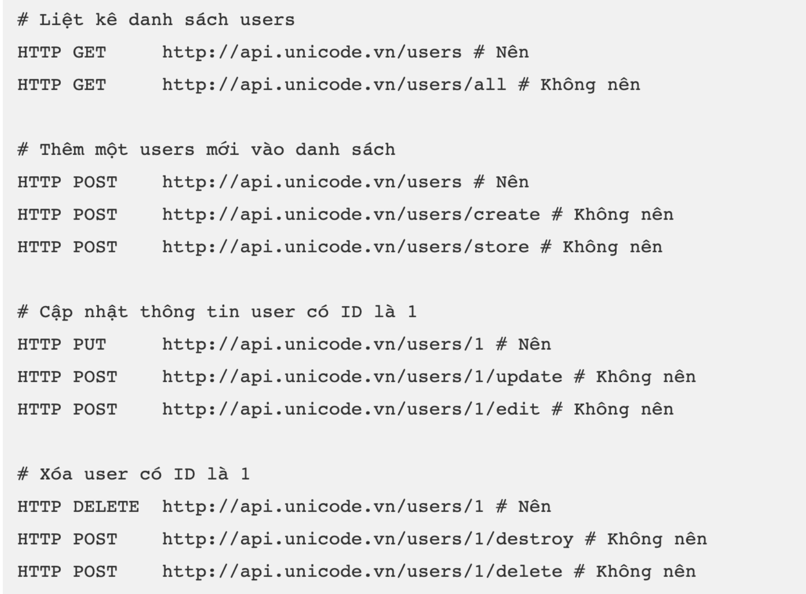

# Xây dựng RESTFul API

## Khái niệm API

- API là viết tắt của Giao diện lập trình ứng dụng (tiếng Anh: Application Programming Interface)

- Tập hợp các định nghĩa và giao thức cho phép các phần mềm khác nhau giao tiếp với nhau

- API hoạt động như một cầu nối giữa hai ứng dụng, cho phép chúng trao đổi dữ liệu và thực hiện các chức năng.

Ví dụ:

- Frontend với Back-end
- Back-end với Back-end
- Phần mềm với hệ điều hành
- API trong các framework / thư viện

## Khái niệm RESTFul API

- REST (Representational State Transfer) là một dạng chuyển đổi cấu trúc dữ liệu, một kiểu kiến trúc để viết API. Nó sử dụng phương thức HTTP đơn giản để tạo cho giao tiếp giữa các máy. Vì vậy, thay vì sử dụng một URL cho việc xử lý một số thông tin người dùng, REST gửi một yêu cầu HTTP như GET, POST, DELETE, vv đến một URL để xử lý dữ liệu.

- RESTful API là một tiêu chuẩn dùng trong việc thiết kế API cho các ứng dụng web (thiết kế Web services) để tiện cho việc quản lý các resource

- RESTful API chú trọng vào tài nguyên hệ thống (tệp văn bản, ảnh, âm thanh, video, hoặc dữ liệu động…), bao gồm các trạng thái tài nguyên được định dạng và được truyền tải qua HTTP.

## HTTP METHOD và Endpoint

### HTTP METHOD

- GET: Được sử dụng để lấy thông tin từ sever theo URL đã cung
  cấp.
- POST: Gửi thông tin tới sever thông qua HTTP Request (Chỉ dùng
  để tạo mới)
- HEAD: Giống với GET nhưng response trả về không có body, chỉ
  có header
- PUT: Ghi đè tất cả thông tin của đối tượng với những gì được gửi
  lên (Nếu dữ liệu nào không được gửi lên sẽ bị xoá)
- PATCH: Ghi đè các thông tin được thay đổi của đối tượng
- DELETE: Xóa tài nguyên trên server

### Endpoint

URL + METHOD

```shell
GET /users
GET /users/{id}
POST /users
PUT /users/{id}
PATCH /users/{id}
DELETE /users/{id}
```

Cấu trúc dữ liệu để viết Endpoint

- JSON
- XML

## Resource

- Resource là dữ liệu mà chúng ta phải quản lý, có thể là: customers, products, posts, images, videos…

- Resource cũng sẽ xuất hiện trong cách viết EndPoint, nên nếu đặt tên cho resource một cách khoa học, thì endpoint cũng trở nên dễ hiểu và dễ tiếp cận hơn

| URL                                     | Resource |
| --------------------------------------- | -------- |
| https://api.unicode.vn/users            | users    |
| https://api.unicode.vn/users/1/accounts | accounts |
| https://api.unicode.vn/users/1/images   | images   |

### Sử dụng danh từ để đặt tên cho resource

| URL                            | Ý nghĩa                    |
| ------------------------------ | -------------------------- |
| https://api.unicode.vn/users   | Liệt kê tất cả users       |
| https://api.unicode.vn/users/1 | Chi tiết user có ID bằng 1 |
| https://api.unicode.vn/posts   | Liệt kê tất cả posts       |
| https://api.unicode.vn/posts/1 | Chi tiết post có ID bằng 1 |

### Sử dụng dấu / để thể hiện mối quan hệ phân cấp giữa các resources

| URL                                   | Ý nghĩa                                     |
| ------------------------------------- | ------------------------------------------- |
| https://api.unicode.vn/users          | Liệt kê tất cả users                        |
| https://api.unicode.vn/users/1        | Chi tiết user có ID bằng 1                  |
| https://api.unicode.vn/users/1/images | Liệt kê tất cả images của user có ID bằng 1 |

### Dùng dấu gạch ngang (-) để ngăn cách giữa các cụm từ

### Sử dụng chữ thường cho toàn bộ Endpoint

### Không sử dụng phần mở rộng để thiết kế Endpoint

### Sử dụng Query Params để lọc kết quả

| URL                                           | Đánh giá  |
| --------------------------------------------- | --------- |
| https://api.unicode.vn/users?country=vn       | Tốt       |
| https://api.unicode.vn/users/vn               | Không tốt |
| https://api.unicode.vn/users?page=1           | Tốt       |
| https://api.unicode.vn/users/pages/1          | Không tốt |
| https://api.unicode.vn/users/?order_by=latest | Tốt       |
| https://api.unicode.vn/users/order_by?latest  | Không tốt |

### Ngoại lệ

API đăng nhập

https://api.unicode.vn/auth/login

https://api.unicode.vn/auth/register

## Sử dụng HTTP Method để thể hiện CURD

Không nên thể hiện các thao tác với resource bằng việc chỉ ra trên URL, thay vào đó bạn hãy sử dụng các HTTP method tương ứng



## Định dạng dữ liệu trong RESTful API

- application/json
- application/xml
- application/x-wbe+xml
- application/x-www-form-urlencoded
- multipart/form-data

## Response Status Code

- 200: Trả về thành công cho những phương thức GET, PUT, PATCH hoặc
  DELETE
- 201: Trả về khi một Resource vừa được tạo thành công
- 204: Trả về khi Response không có dữ liệu
- 304: Client có thể sử dụng dữ liệu cache
- 400: Request không hợp lệ
- 401: Request cần có auth (Xác thực)
- 403: Bị từ chối không cho phép
- 404: Không tìm thấy resource từ URL
- 405: Phương thức không cho phép với user hiện tại
- 410: Resource không còn tồn tại, Version cũ đã không còn hỗ trợ
- 415: Không hỗ trợ kiểu Resource này (Ví dụ: Thiếu Content-Type hoặc Content-Type bị sai)
- 422: Dữ liệu không được xác thực
- 429: Request bị từ chối do bị giới hạn

## Sự khác nhau giữa 400 và 422

### 400

- Lỗi do client gửi yêu cầu không hợp lệ.
- Lỗi có thể do cú pháp sai, thiếu thông tin bắt buộc hoặc dữ liệu không hợp lệ.

Ví dụ:

- Thiếu tham số trong URL.
- Định dạng JSON không hợp lệ.
- Giá trị không hợp lệ cho một trường.

### 422

- Lỗi do client gửi yêu cầu hợp lệ về cú pháp nhưng không thể xử lý được.
- Lỗi thường xảy ra khi dữ liệu trong yêu cầu không đáp ứng các quy tắc nghiệp vụ của API.

Ví dụ:

- Gửi yêu cầu tạo tài khoản với mật khẩu quá ngắn.
- Gửi yêu cầu thanh toán với số tiền âm.
- Gửi giá trị cho một trường không được phép.

Lưu ý:

- Mã 422 được giới thiệu trong HTTP/1.1.
- Một số API có thể sử dụng mã 400 thay cho 422.

## Response Body và API Version

### Response Body

Cần thống nhất Response body trong các Endpoint

```json
{
  "status": 200,
  "message": "Success",
  "data": [
    {
      "id": 1,
      "name": "User 1",
      "email": "user1@gmail.com",
      "created_at": "2024-03-23 09:00:00"
    },
    {
      "id": 2,
      "name": "User 2",
      "email": "user2@gmail.com",
      "created_at": "2024-03-23 09:00:00"
    },
    {
      "id": 3,
      "name": "User 3",
      "email": "user3@gmail.com",
      "created_at": "2024-03-23 09:00:00"
    }
  ],
  "errors": {}
}
```

```json
{
  "status": 200,
  "message": "Success",
  "data": {
    "id": 1,
    "name": "User 1",
    "email": "user1@gmail.com",
    "created_at": "2024-03-23 09:00:00"
  },
  "errors": {}
}
```

```json
{
  "status": 400,
  "message": "Error",
  "errors": {
    "name": "Name is required"
  }
}
```

### API Version

- Khi làm việc với API cần phải có phiên bản để không làm ảnh hưởng tới các hệ thống cũ
- Có nhiều cách để tạo version cho API

* Sử dụng URL
* Sử dụng Header

## Rate Limit

Kỹ thuật giới hạn số lần request trong 1 đơn vị thời gian nhất định

Ví dụ:

- Mỗi người dùng chúng ta chỉ cho phép gửi 100request/s. Nếu vượt quá thì sẽ trả về response lỗi.
- Mỗi người dùng chỉ cho phép nhập sai thẻ credit 3 lần trong 1 ngày
- Mỗi địa chỉ IP chỉ có thể tạo được 2 account trong 1 ngày.

Tác dụng của Rate Limit

- Hạn chế tấn công DOS (Denial of Service) đến hệ thống
- Hạn chế brute force password trong hệ thống (quyét kiểu vét cạn)
- Hạn chế Brute force thông tin thẻ credit card (quyét kiểu vét cạn)
- Bảo mật: Không cho phép nhập sai password quá nhiều lần
- Doanh thu: Với mỗi plan sẽ có rate limit khác nhau. Nếu muốn dùng nhiều hơn thì cần mua lên plan đắt tiền hơn.

Cách triển khai Rate Limit

- Rate Limit theo cái gì?

* IP --> Thường áp dụng cho các API Public
* User --> Các API Private (Xác thực Email và Password)
* API Key --> API Private (Xác thực bằng API Key)

- Lưu trữ số lượng Request ở đâu?

* Database
* Bộ nhớ đệm trên Server: APC, Redis, In-Memory,...
* File

- Xây dựng logic

* Xác định số lượng Request
* Đơn vị thời gian: phút, giờ, ngày,...

Ví dụ: Theo địa chỉ IP, 60 requests / phút

Khi có Request, thực hiện các thao tác sau

- Lấy địa chỉ Ip
- Lấy số lượng request cũ với địa chỉ IP vừa lấy được, nếu chưa có trong kho lưu trữ --> Khởi tạo giá trị 0 và thời gian gửi request đầu tiên
- Tăng số lượng request thêm 1
- Cập nhật vào kho lưu trữ

Trong middleware kiểm tra

- Lấy được số lượng request của địa chỉ IP đang gửi Request
- Nếu vượt quá giá trị cho phép --> Kiểm tra thời gian hiện tại --> So sánh với thời gian của request đầu tiên

* Nếu thời gian hiện tại < thời gian quy định (1 phút) --> Block
* Nếu thời gian hiện tại > thời gian quy định (1 phút) --> Reset số lượng request về 1 và cập nhật lại thời gian
